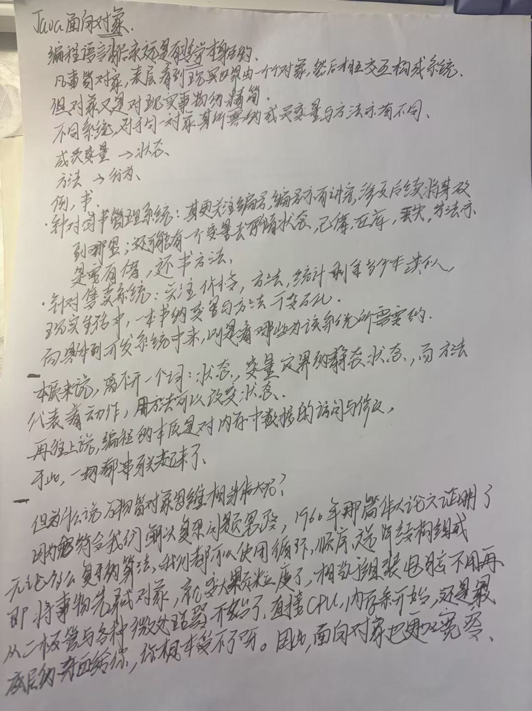

# 编程随想：面向对象背后的哲学
## 1. 对象的本质：现实的精简与“境界”
编程语言背后永远是有哲学存在的。

凡世界对象，表层看到现实世界由一个个对象组成，然后相互交互构成系统。但对象又是对现实事物的“境界”（精简/抽象）。

不同系统对于同一对象，其所具有的成员变量与方法亦有不同：

成员变量对应的是状态。

方法对应的是行为。

例如：

图书管理系统中的“书”：更关注编号。编号亦有讲究，涉及到后续将放到哪里，还可能有一个变量去存储状态，比如：已借、在库、丢失。涉及到方法的话，那亦要有借书或者还书的方法。

售卖系统中的“书”：更加关注价格。对于方法，更会针对统计剩余多少本书。

类似现实生活中一本书的变量与方法也是千变万化的。而涉及到具体开发来看，那总要看哪些为该系统所需要的呢？

本质来说，离不开一个词：状态变量。定界的是静态状态，而方法代表着动作。方法可以改变状态。

## 2. 宏观串联：从内存到万物皆对象
在网上说，编程的本质是对内存中数据的访问与修改，与此一切都串联起来了。

但为什么说“万物皆对象”这种面向对象思维相当伟大呢？因为它符合我们解决复杂问题的思路。

1966 年那篇伟大的论文（Böhm-Jacopini 定理）证明了：无论多么复杂的算法，我们都可以使用循环、顺序、选择结构组成。

面向对象（OOP）的进阶：

将事物先弄成对象，就变成了大颗粒度的东西。

相当于组装电脑，就不再需要从二极管与微处理器开始了，直接上手就是 CPU 那种级别。

因此，面向对象也是一种更加“宽容”的做法，它让更多人能够入行。

